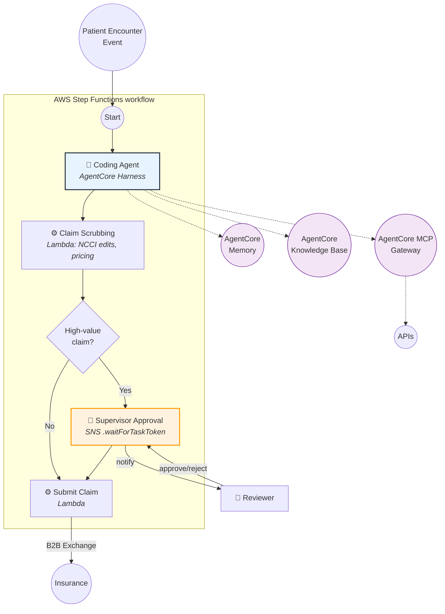

# Orchestrating Deterministic and Agentic AI Workflows: AWS Step Functions with Amazon Bedrock AgentCore Harness

---

## Introduction

As AI-powered agents become increasingly capable, enterprises need a way to incorporate their reasoning into business workflows while preserving deterministic execution, auditability, compliance, and human approval processes.

The answer is not to hand the entire workflow to an agent — it is to let the workflow engine own sequencing and let agents own reasoning within individual steps.

This document introduces a pattern that combines AWS Step Functions — a visual workflow service with built-in error handling, parallel execution, and human approval steps — with Amazon Bedrock AgentCore Harness, which lets you declare an agent through configuration (model, tools, system prompt) and invoke it as a native Step Functions task.

We illustrate this pattern through a simplified healthcare medical billing scenario, demonstrating how deterministic orchestration and bounded AI reasoning can coexist in a regulated domain.

---

## What's New: AWS Step Functions Adds AgentCore-Powered Agentic Reasoning Step

AWS Step Functions offers a native, optimized service integration with the Amazon Bedrock AgentCore managed harness, now generally available in all AWS Regions where AgentCore harness is supported. You can add AI agent reasoning steps directly in your workflow using the resource `arn:aws:states:::bedrockagentcore:invokeHarness` — no container to build or operate.

The AgentCore harness lets you declare an agent through configuration where you specify the model, tools, and behavior. AgentCore provides the managed environment that runs the agent loop end-to-end. With this integration, you can automate reasoning tasks in your workflow such as classifying a document, extracting elements from an unstructured form, or assigning medical codes to clinical observations.

### Key Capabilities

- **Fully declarative agent definition:** Specify the model, system prompt, tools, and behavior directly in the Step Functions task definition.
- **Per-invocation overrides:** Swap the model (e.g., a stronger model for coding, a cheaper one for drafting), system prompt, toolset, max iterations, max tokens, and timeout — all without duplicating harness configurations.
- **Parallel and sequential agents:** Run multiple agents at different decision points in a single workflow.
- **Human approval gates:** Add `.waitForTaskToken` states around agent invocations for critical actions requiring human review.
- **Full observability:** Execution history shows agent input, output, token usage, and duration with links to agent turn details in Amazon CloudWatch.
- **Session continuity:** Persist agent context across invocations using a session ID that works within or across workflow executions.

---

## The Design Pattern: Deterministic Orchestration with Bounded Agent Reasoning

The core architectural principle is a strict separation of concerns:

1. **Step Functions owns sequencing** — the deterministic "what happens and when." It enforces compliance gates, branching logic, retries, error handling, and human approval steps.
2. **AgentCore Harness owns bounded reasoning** — the "how" within individual steps. Each agent is narrow, single-purpose, and cannot bypass workflow controls.

This means a compliance reviewer can read the state machine definition and understand the execution path independent of any agent's runtime reasoning. The agent's scope is bounded by its toolset and system prompt — it cannot decide workflow order or skip a gate.

### Why This Pattern Matters

- **Auditability** — The execution path lives in the state machine definition, not inside an LLM's reasoning chain.
- **Bounded agent scope** — Each agent has a narrow task and small toolset. No generalist agent decides workflow order.
- **Hard compliance gates** — Human approval steps are Choice + `waitForTaskToken` states that agents cannot bypass.
- **Reusability** — The same harness can be reused across workflows with per-invocation overrides (model, prompt, tools).
- **Cost control** — Different model tiers for different reasoning tasks, with full token usage tracking per invocation.

---

## Use Case: Healthcare Medical Billing and Coding

To illustrate this pattern with a real-world scenario, we use healthcare medical billing — one of the most error-prone, labor-intensive, and heavily regulated back-office processes in the US healthcare system.

When a patient sees a provider, the provider must be paid for services rendered. Most of that payment comes from an insurance payer rather than the patient directly. The end-to-end process of turning a clinical encounter into a paid claim is called the healthcare revenue cycle.

Two numbers explain why this is a worthwhile automation target:

- **~17% of in-network claims were denied on first submission in ACA Marketplace plans** — due to coding errors, eligibility lapses, bundling edits, or missing documentation ([KFF, 2023](https://www.kff.org/private-insurance/claims-denials-and-appeals-in-aca-marketplace-plans/)).
- **~$44 per claim to rework a denial** — adding up to ~$20 billion annually in avoidable administrative spend industry-wide ([Premier Inc., 2024](https://www.premierinc.com/newsroom/blog/trend-alert-private-payers-retain-profits-by-refusing-or-delaying-legitimate-medical-claims)).

Denials cluster around a small set of recurring causes, making the revenue cycle a strong fit for a system that combines deterministic rules (auditable and cheap) with bounded AI reasoning (handling judgment-heavy steps like assigning codes).

---

## The Medical Billing Workflow

The medical billing pipeline, as defined by industry standards (AAPC, CMS, AHIMA), follows these key steps:

1. **Patient Registration** — Capture demographics, insurance information, and verify patient identity.
2. **Insurance Eligibility and Benefits Verification** — Confirm the patient's coverage is active and determine what services are covered under their plan.
3. **Patient Encounter and Clinical Documentation** — The provider documents diagnoses, procedures, and observations during the visit (in EHR systems, as FHIR Encounter/Condition/Procedure resources).
4. **Medical Coding** — Translate clinical documentation into standardized codes: ICD-10-CM for diagnoses, CPT/HCPCS for procedures.
5. **Claim Scrubbing and Validation** — Check assigned codes against payer rules, NCCI bundling edits, and coverage policies before submission.
6. **Claim Submission** — Submit the validated claim (837 EDI transaction) to the payer via a clearinghouse or B2B exchange.
7. **Payer Adjudication** — The insurance company processes the claim and decides payment based on the patient's coverage and the submitted codes.
8. **Payment Posting and Reconciliation** — Record the payment or denial from the remittance advice (835 EDI transaction) and reconcile with the original claim.

Medical coding is the critical intelligence step in this pipeline. It involves judgment — the same encounter can be coded differently depending on documentation quality, payer-specific rules, and bundling edits. This makes it an ideal candidate for bounded AI reasoning.

### Medical Code Families

Two families of codes drive the billing process:

**Diagnosis Codes (ICD-10-CM)** — Maintained by CDC/CMS. International Classification of Diseases, 10th Revision, Clinical Modification. Answers "what is wrong with the patient." Example: J20.9 (Acute bronchitis, unspecified).

**Procedure Codes (CPT)** — Maintained by the American Medical Association (AMA). Current Procedural Terminology. Describes "what was done for the patient." Example: 99213 (Office visit, established patient, low complexity).

**HCPCS Level II** — Maintained by CMS. Healthcare Common Procedure Coding System. Covers supplies, drugs, ambulance services, and equipment not captured by CPT. Example: A0427 (ALS emergency transport).

These codes are universal across the US healthcare industry and required for every claim submitted to a payer. Accurate assignment of these codes is the step where AI reasoning adds the most value.

---

## Mapping the Billing Workflow to AWS Services

The following table shows how each step of the medical billing workflow maps to the AWS architecture:

| Workflow Step | AWS Service | Type | Notes |
|---|---|---|---|
| Patient data storage | AWS HealthLake (FHIR R4) | Data Layer | System of record |
| Event trigger | HealthLake FHIR Subscription → Amazon EventBridge | Deterministic | On encounter finalization |
| Eligibility check | Lambda → HealthLake | Deterministic | Coverage lookup |
| Medical coding | AgentCore Harness | Agentic | CPT/ICD assignment |
| Claim scrubbing | AWS Lambda | Deterministic | NCCI edits |
| High-value routing | Step Functions Choice | Deterministic | Threshold check |
| Human approval | SNS .waitForTaskToken | Human-in-Loop | High-value claims only |
| Claim submission | Lambda → B2B Data Interchange | Deterministic | 837 EDI transaction |

---

## The Coding Agent: Bounded AI Reasoning for Medical Code Assignment

The coding agent is a single-purpose AgentCore Harness invocation within the Step Functions workflow. It handles the judgment-heavy step of translating clinical documentation into standardized medical codes.

The agent performs the following bounded tasks:

1. **Read encounter data** — Retrieves the encounter narrative and existing Condition/Procedure FHIR resources from HealthLake.
2. **Propose codes** — Assigns ICD-10-CM diagnosis codes and CPT/HCPCS procedure codes based on the clinical observations.
3. **Validate against payer policy** — Checks proposed codes against payer-specific billing policies retrieved via the AgentCore Knowledge Base (RAG).
4. **Check bundling edits** — Validates against NCCI (National Correct Coding Initiative) bundling edits using MCP tools exposed through the AgentCore Gateway.
5. **Recall prior patterns** — Uses AgentCore Memory to recall this provider's prior coding decisions from a provider-scoped namespace via the harness's automatic semantic retrieval, for consistency.
6. **Return structured output** — Outputs a structured JSON payload with the assigned codes, confidence scores, and reasoning for the next deterministic step to consume.

The agent is invoked declaratively from the Step Functions task state. The harness owns what capabilities exist (Memory, Gateway, Knowledge Base); the task state owns how each call behaves (model, system prompt, allowed tools, max iterations, timeout).

---

## Architecture Workflow

The billing workflow expressed as a Step Functions state machine follows this sequence. Each step is clearly labeled as Deterministic, Agentic, or Human-in-the-Loop:

Key design decisions in this workflow:

- **Request-Response only** — The `invokeHarness` integration has a 15-minute maximum with no `.sync` or `.waitForTaskToken` support. Async approval gates are modeled as separate states around the agent invocation.
- **Hard Choice states** — The high-value routing decision is a Step Functions Choice state, not an agent suggestion. The agent cannot bypass this compliance gate.
- **One Gateway for all tool access** — Both the Knowledge Base and MCP tools route through a single AgentCore Gateway, so Policy and Bedrock Guardrails apply uniformly.

---

## Why This Pattern Fits Healthcare

Healthcare billing is an ideal domain for the Step Functions + AgentCore Harness pattern for several reasons:

- **High denial rates** — ~17% of in-network claims denied on first submission in ACA Marketplace plans ([KFF](https://www.kff.org/private-insurance/claims-denials-and-appeals-in-aca-marketplace-plans/)), primarily due to coding errors, eligibility lapses, and missing documentation.
- **Costly rework** — ~$44 per claim to rework a denial, adding up to ~$20B annually in avoidable spend industry-wide ([Premier Inc.](https://www.premierinc.com/newsroom/blog/trend-alert-private-payers-retain-profits-by-refusing-or-delaying-legitimate-medical-claims)).
- **Recurring patterns** — Denial causes cluster around a small set of root causes (eligibility, coding, bundling edits) that are well-suited to bounded AI reasoning.
- **Regulatory tailwinds** — The CMS-0057-F rule (effective 2026–2027) requires payers to expose structured denial reasons and prior authorization decisions via FHIR APIs, creating new opportunities for automated triage.
- **Auditability requirements** — Healthcare is a regulated industry where every decision must be explainable. The deterministic state machine provides a clear audit trail independent of agent reasoning.

The CMS-0057-F rule is particularly significant: starting 2026, payers must return specific reasons for every prior authorization denial and publicly report approval/denial metrics. Starting 2027, payers must expose four FHIR-based APIs. This creates a machine-readable signal layer that agent-based workflows can consume to automate triage and improve first-pass acceptance rates.

---

## Conclusion and Next Steps

The integration of AWS Step Functions with Amazon Bedrock AgentCore Harness opens a new design space: workflows where deterministic orchestration and bounded AI reasoning coexist, each handling what it does best.

Medical billing is one powerful example, but the pattern applies wherever you need auditable, compliant automation with AI judgment at specific decision points — content moderation, document processing, insurance underwriting, or regulatory filings.

This architecture works well when you need:

- Auditability in regulated industries where you must explain how a decision was made.
- Problems that span specialized areas where focused agents outperform generalist ones.
- Predictable workflows where the execution path is known in advance, even if reasoning at each step is dynamic.

It is less suited for open-ended conversations, single-domain tasks where one agent with a good prompt is enough, or low-latency chat scenarios.

### Beyond Medical Billing: Applicability Across Industries

While this document uses healthcare medical billing as the illustrative use case, the Step Functions + AgentCore Harness pattern is broadly applicable to any domain where structured workflows require AI judgment at specific decision points. Examples include:

- **Financial Services** — Loan underwriting, fraud detection triage, KYC/AML document review, and trade compliance checks where regulatory auditability is mandatory.
- **Insurance** — Policy underwriting, claims adjudication, and coverage determination where domain-specific rules intersect with unstructured document interpretation.
- **Content Moderation** — Multi-step review pipelines where AI classifies content, deterministic rules enforce policy thresholds, and borderline cases escalate to human reviewers.
- **Supply Chain and Manufacturing** — Quality inspection workflows where sensor data triggers AI-based defect classification followed by deterministic routing for rework or approval.
- **Legal and Regulatory** — Contract review, regulatory filing validation, and compliance monitoring where documents must be parsed, classified, and routed through approval chains.

---

*Feature announcement:* https://aws.amazon.com/about-aws/whats-new/2026/06/aws-step-functions-agentcore/

*Medical coding reference:* https://www.aapc.com/resources/getting-started-in-medical-coding-and-billing-a-guide-to-the-fundamentals
